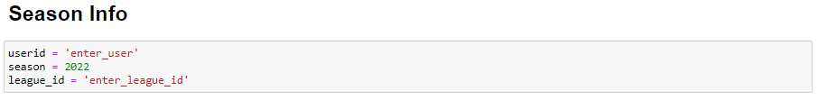

# Sleeper draft analysis

Simply enter your team name and league ID into the season info cell (shown below) and run the notebook.

The notebook will then save a csv with the draft info, fantasy stats, and a value metric that I created that you can use to analyze your draft.
